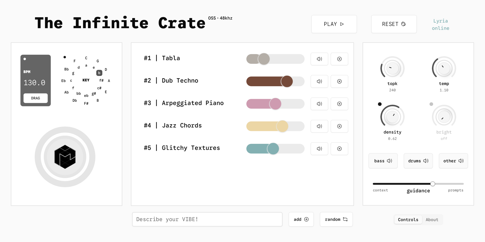
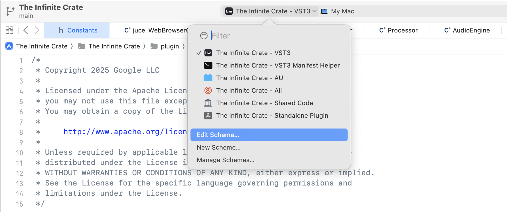
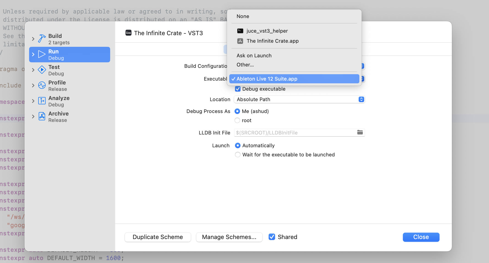
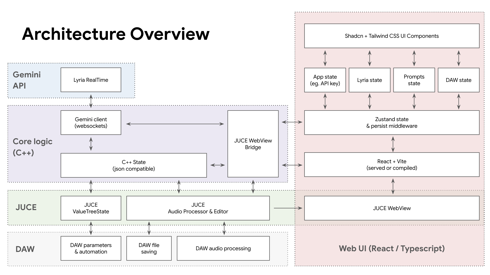

# The Infinite Crate

The Infinite Crate is an open source experimental DAW plugin built on the new [Lyria RealTime](https://deepmind.google/models/lyria/realtime/) live music model in the Gemini API. The plugin allows users to mix together text prompts to steer a live music model in real-time, feeding audio directly into your DAW for sampling, live performance, or just giving you a practice partner to jam with.

The plugin is built with Typescript/React for the UI (with hot reload for rapid iteration) and C++/JUCE for audio processing and Lyria streaming. You can download prebuilt VST3 (Windows/Mac), AU (Mac), and Standalone (Mac) versions on the [Magenta website](https://magenta.withgoogle.com/infinite-crate).

&nbsp;

## Table of Contents
1. [Initial Setup](#initial-setup)
2. [Building and Debugging](#building-and-debugging)
3. [Codebase Architecture](#codebase-architecture)
4. [State, Params, Types, and Structs](#state-params-types-and-structs)

&nbsp;

## Initial Setup

### MacOS
1. Install IDE and dependencies:
    - Xcode + command line tools
    - Download "JUCE and Projucer": https://juce.com/download/
    - Use [brew](https://brew.sh/) to install "npm" and "openssl@3"
2. Clone this repo
3. Run "cd react_ui && npm run init"
6. Open the-infinite-crate.jucer file in Projucer:
    - If prompted: follow Projucer's instructions to specify the location of the JUCE folder and modules folder
    - In Projucer Exporters->Xcode->Debug/Release->Header Search Paths and Extra Library Search paths: make sure this includes the location of your homebrew installation (typically /opt/homebrew or $(HOME)/homebrew)
7. Export the Xcode project in Projucer

### Windows
1. Install IDE and dependencies:
    - Visual Studio 2022
    - Download "JUCE and Projucer": https://juce.com/download/
    - Install "OpenSSL" from [Shining Light Productions](https://slproweb.com/products/Win32OpenSSL.html) or other source
4. Clone this repo
5. Run "cd react_ui && npm run init" 
    - Git bash is recommended over powershell
6. Open the .jucer file in Projucer:
    - If prompted: follow Projucer's instructions to specify the location of the JUCE folder and modules folder
    - In Projucer Exporters->Visual Studio 2022->Debug/Release->Header Search Paths and Extra Library Search paths: make sure this includes the location of your OpenSSL installation
    - Generate the Visual Studio project
7. Open the generated Visual Studio project:
    - Right click on VST3, select "Set as Startup Project"
    - Add Microsoft.WebView2 NuGet package (eg. version 2.1.0.3405.78) to the solutions via the NuGet Package Manager
8. In Projucer:
    - Update Header Search Paths and Extra Library Search Paths to reference the exact WebView2 version (eg. 2.1.0.3405.78) and location 
    - Export the project again

&nbsp;

## Building and Debugging

The project can be built in "development" mode or "production" mode. Development mode runs the UI on a Vite local server (`npm run dev`) and allows for hot reload of UI changes in the react_ui folder. Production mode compiles the UI into static files bundled into the plugin itself (`npm run compile`).

### Building as a Standalone app
1. Run `npm run dev` from the react_ui folder
2. Run the "Standalone" scheme in Xcode or Visual Studio
3. The standalone app will be located inside `Builds/MacOS/build/Debug/**`

### Building as a VST3
1. Run `npm run dev` from the react_ui folder
2. Run the "VST3" scheme in Xcode or Visual Studio
3. The VST3 will be located inside `Builds/MacOS/build/Debug/**` or `Builds/VisualStudio2022/x64/Debug/**`

### Building for production
1. Run `npm run compile` from the react_ui folder
2. Open the file plugin->utils->constants.cpp:
    - Set "DEV" to false

### Installing the plugin
Set the `VST3 Plug-In Custom Location` in Ableton settings to the location of the compiled VST3 in `Builds` or move the VST3/AU into your system VST3/AU folder.

### Debugging

#### MacOS
We recommend debugging in Ableton or Reaper. 

Debugging on MacOS in Ableton requires downloading the [add_debug_entitlement.sh](https://gist.github.com/talaviram/1f21e141a137744c89e81b58f73e23c3) script and running it on the Ableton Live app (`sudo ./add_debug_entitlement.sh "/Applications/Ableton Live 12 Suite.app`).

1. Edit the VST3 Xcode scheme. 
    
2. Navigate to Run->Info->Executable and choose your DAW as the target from your Applications folder.
    

#### Windows
Debugging on Windows can be done by right clicking on "The Infinite Crate_VST3" solution and changing the debugging properties.

### Notes
1. To fix resolution issues in Ableton in Windows, click on the `...` icon on the plugin and deselect "Auto-Scale Plugin Window".
2. The project currently does not support standalone mode on windows due to the way resources are bundled in the VST3. It should be possible by bundling the resources in the .exe or placing then next to the .exe.
3. We do not provide instructions for building for multiple architectures (eg. MacOS Universal). Doing so requires creating a fat binary for OpenSSL (libSSL.a, libCrypto.a) and codesigning these properly.
4. Building the plugin for other users on MacOS requires enabling hardened runtime in projucer and codesigning.
5. To remove the notification bar in standalone mode, comment out this line in juce_StandaloneFilterWindow: `enum { height = 0 };`

&nbsp;

## Codebase Architecture

The codebase leverages C++/JUCE for audio processing and websockets connection to the Gemini API. The UI is built in Typescript using React, and Shadcn UI for components, Zustand for state management. The React app is served using Vite with hot-reload in development mode and compiled with Vite for production. The core codebase components are described below.

### plugin
- audio
    - `AudioEngine` - core audio processing engine and buffer management
    - `CircularBuffer` - circular buffer class for audio processing
    - `Transport` - transport class for DAW transport comms (currently unused)
- data
    - types
        - `GeminiTypes` - types for Gemini/Lyria API
        - `StateTypes` - types for plugin state (mirrored with Zustand)
        - `Types` - types for C++/JUCE params
    - `State` - Plugin state updating, syncing (to React/Zustand), saving, and loading
- networking
    - `Gemini` - Gemini API client
    - `WebBridge` - bridge code between C++ and React UI for bidirectional comms and state syncing
    - `WebSocket` - websocket connection management
- ui
    - `Container` - JUCE plugin editor container that creates and wraps the webview for the React UI
- utils
    - `Aliases` - type aliases for common types (to reduce verbosity of std:: and juce:: namespaces)
    - `Constants` - constants values
    - `Functions` - utility functions
    - `Optionals` - macro for json to struct conversion supporting optionals
- `Processor` - JUCE AudioProcessor that creates and routes calls to AudioEngine, State, and WebBridge

### react_ui
- `config` - typescript and vite config files
- src
    - components
        - lyria
            - `controls` - React components for Lyria controls
            - `prompts` - React components for prompts
        - ui
            - `atoms` - custom UI components
            - `shadcn` - Shadcn UI components
    - data
        - `params` - definition of parameters used by the React UI and mapped to C++ & Juce params (int, float, choice, bool). params with daw=true are exposed to the DAW for automation
        - `slices` - Zustand slices (state management and update methods)
        - state
            - `bridge` - bridge code between React UI and C++ leveraging Zustand state storage middleware and JUCE webview native functions for bidirectional comms and state syncing
            - `state` - Zustand state creator and accessor methods
        - `types
            - `factory` - factory functions for parameter definitions
            - `lyria` - lyria types (mirrored with C++ structs)
            - `types` - typescript types
    - layout
        - `geometry` - React components for div, grid, flexbox, and window resizing
        - `views` - React components for views
    - lib
        - `juce` - JavaScript bindings for JUCE C++ bidirectional comms
        - `theme` - light/dark color theme and fonts
        - `utils` - constants and utility/helper functions

### resources
- `dom` - location of compiled DOM files (html/css/js) for production builds (ie. "npm run compile")
- `fonts` - font files
- `img` - image files
- `json` - generated schema files used by C++ code to define JUCE parameters / AudioProcessorValueTreeState

### scripts
- `codesign` - Script to assist codesigning MacOS plugin
- `generate` - Script to generate `schema.json` and `states.json` from TypeScript types and parameters
- `initialize` - Script to initialize the project and copy juce/shadcn files into the react_ui folder

### third_party
- `asio` - C++ library for async networking
- `json` - nlohmann/json C++ library for JSON to C++ struct conversion
- `juce` - JavaScript bindings for JUCE C++ bidirectional comms
- `shadcn` - React UI components based on Radix UI
- `websocketpp` - C++ library for websockets

&nbsp;

## State, Params, Types, and Structs

### Updating plugin parameters

1. Update or create parameters in `react_ui/src/data/params/*.ts`
2. Set `daw: true` to expose parameters to the DAW for DAW control, midi mapping, and automation
3. Run `npm run generate` to regenerate `schema.json` and `states.json`
4. Regenerate the Xcode or Visual Studio project in Projucer

The projucer file converts the schema.json to a binary resource and includes it in the plugin project. The plugin will automatically load and process the binary resource on plugin creation and generate a JUCE AudioProcessorValueTreeState from the schema (in `plugin/data/State.cc | State::getDawParameters()`).

### Updating state types and structs across Typescript and C++

1. Update Typescript types in `react_ui/src/data/types/*.ts`
2. Update Zustand slices in `react_ui/src/data/slices/*.ts`
3. Update C++ structs in `plugin/data/types/StateTypes.h`

The State, WebBridge, and Bridge files will automatically sync state between the React UI and C++ and convert json to structs and back when state is updated using nlohmann/json. **Typescript types, Zustand slices, and C++ structs should be kept in sync.**

### App and plugin data

App Data (eg. API key) is saved system wide, while plugin data (prompt and parameter values) is saved along with the project per plugin instance.

To delete App Data, delete the following files:

**Mac:**
`rm ~/Library/Application\ Support/Magenta/The\ Infinite\ Crate/The\ Infinite\ Crate.settings`

**Windows:**
`rm C:\Users\<username>\AppData\Roaming\Magenta\The Infinite Crate\`

&nbsp;

-----------------------------
### License and Disclaimers
The Infinite Crate is licensed under Apache 2.0. 

The project depends on third party libraries: asio, nlohmann/json, JUCE, shadcn, and websocketpp. Please refer to the [third_party](third_party) directory for information about these libraries.

To compile this project, you will need a valid [JUCE license](https://www.juce.com/get-juce) (free for starter, paid for commercial use).

This is not an officially supported Google product. This project is not eligible for the [Google Open Source Software Vulnerability Rewards Program](https://bughunters.google.com/open-source-security).

